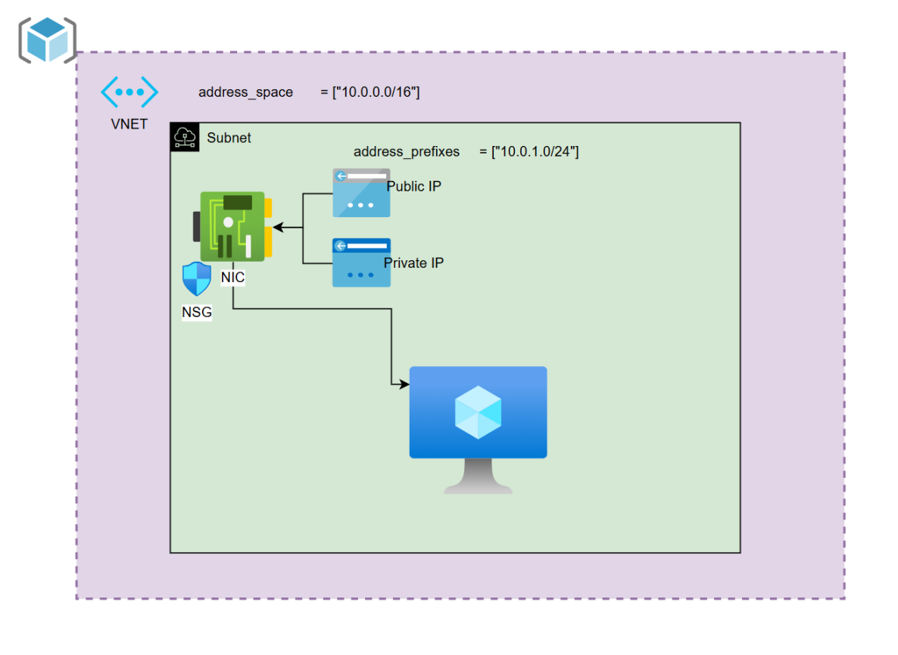

# 🌐 Session 09 – Terraform Variable Files, Validation, and Outputs

---

## 📁 Using `.tfvars` Files

`.tfvars` files are used to assign values to input variables, especially when:

✅ You want to override default values  
✅ You’re working with multiple environments (e.g., `dev`, `prod`)

### 🛠 Example: `prod.tfvars`

location             = "West Europe"
resource_group_name  = "Prod_RG"
🛠 Example: dev.tfvars

location             = "East US"
resource_group_name  = "Dev_RG"
▶️ Apply Using a Specific Variable File

terraform plan -var-file="prod.tfvars"
💡 Note: If -var-file="prod.tfvars" is not provided, Terraform will use the default values from variables.tf.

✅ Variable Validation
Validation allows you to ensure a variable receives only valid and allowed values before execution.

Prevents misconfiguration by stopping execution early

Shows a custom error message when invalid input is detected

🔍 Example: Validate Location

variable "location" {
  type        = string
  default     = "East US2"
  description = "Variable for location"

  validation {
    condition     = contains(["East US2", "West Europe"], var.location)
    error_message = "Location must be one of: East US2, West Europe."
  }
}
📤 Output Variables
Output variables are used to display useful information after your infrastructure has been applied.

Think of them like a print() statement in programming – to see:

What resources were created

Their key properties (e.g., name, location, IP address)

📌 Example: Outputs

output "Resource_Group_name" {
  value = azurerm_resource_group.Prod-RG.name
}

output "Location" {
  value = azurerm_resource_group.Prod-RG.location
}
📂 These can be placed in your main.tf or in a separate file like outputs.tf or results.tf

VM Creation :

